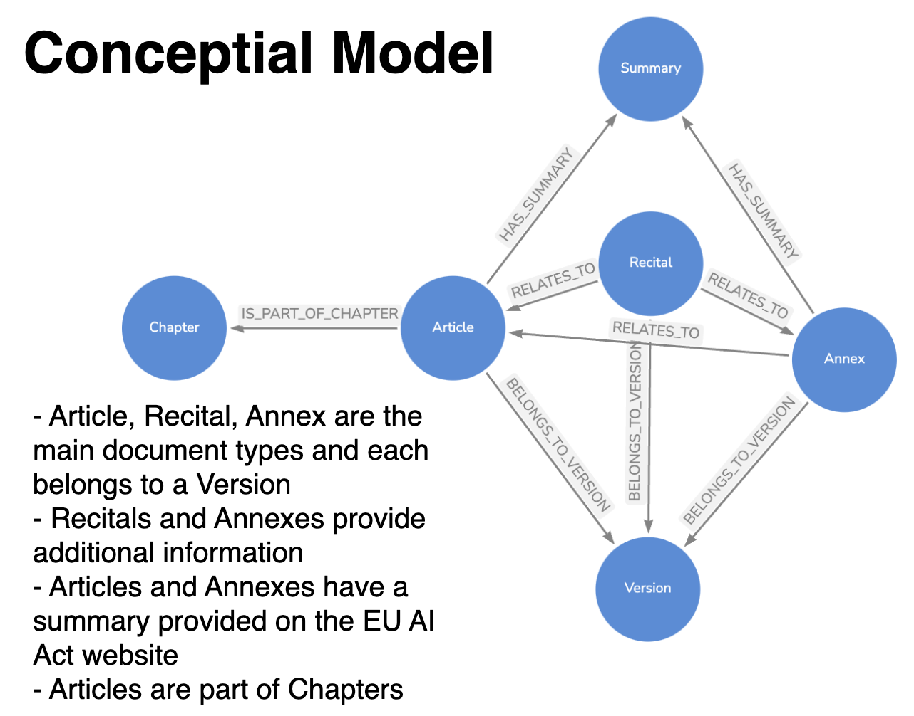
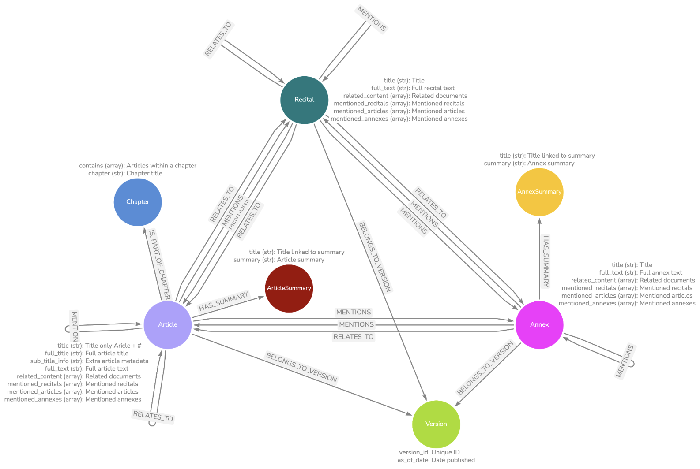
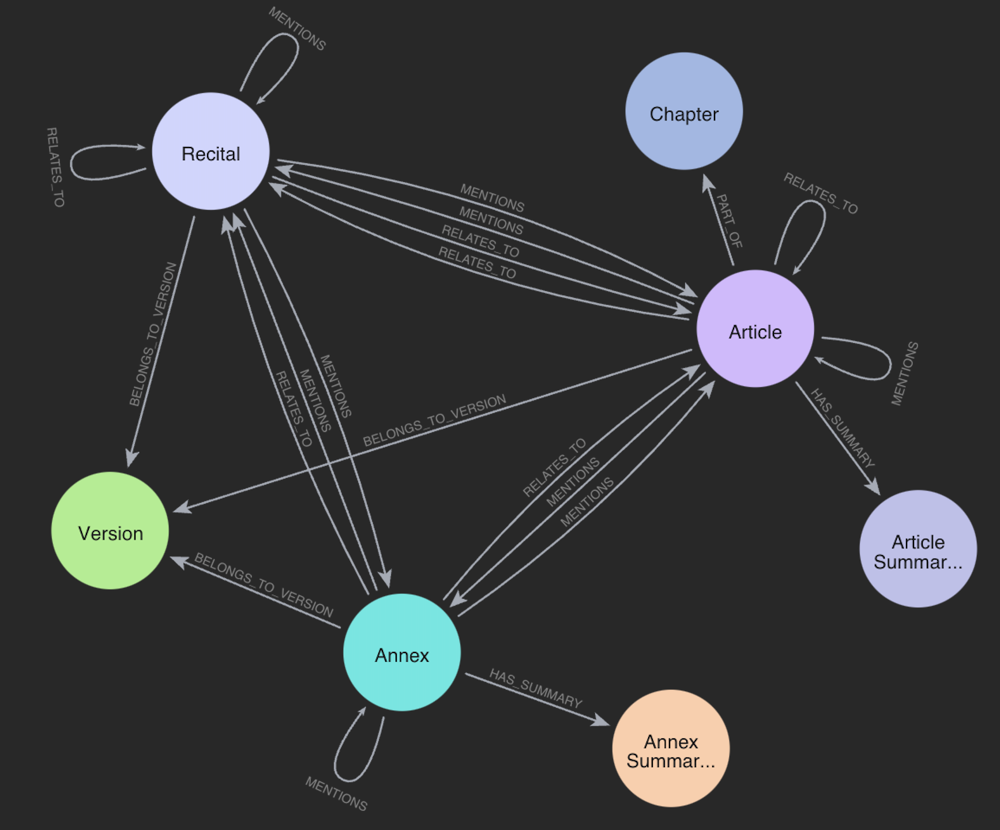

### I read [The AI Engineer's Guide to Surviving the EU AI Act](https://www.oreilly.com/library/view/the-ai-engineers/9781098172480/) by Larysa Visengeriyeva, and it was great. It sparked my interest to learn more about the Act and also I realised it's a good candidate for a graph data model.

### Conceptial Model

### Logical Model

### Neo4j Implementation

#### Files in repo

- the CSVs (articles.csv, annexes.csv, recitals.csv) contain the scraped documents; also given as txt files
- scraping is in the `scrape_data.ipynb`
- *some* of the Cypher code is in `interact_with_neo4j.ipynb`, there are not many nodes (~300 for the 3 main documents) so this is fairly light
- to set up Neo4j locally, run `docker-compose up -d` (username & pwd are in the `docker-compose.yml`) 
